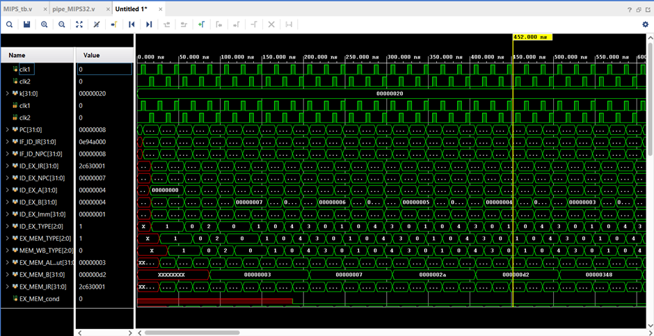

# MIPS 32 Microprocessor

## Overview
This project implements a MIPS 32 microprocessor using Verilog in Xilinx Vivado. It follows a RISC architecture and supports a wide range of instructions and addressing modes. The processor is capable of accurately executing assembly language programs and provides robust functionality for real-world applications.

## Features
- **32 General-Purpose Registers (GPRs)**: 32-bit registers for data storage and processing.
- **32-bit Program Counter (PC)**: Keeps track of the next instruction to execute.
- **Instruction Formats Supported**:
  - **R-type**: Operates on two source registers, performs an operation (e.g., addition, subtraction), and stores the result in a destination register.
  - **I-type**: Uses an immediate value along with registers, typically for operations such as memory access or arithmetic operations.
  - **J-type**: Used for unconditional jumps or procedure calls, transferring control to a specific memory address.
- **Addressing Modes Supported**:
  - **Register Addressing**: Operands are located in registers. Used for R-type instructions.
  - **Immediate Addressing**: A constant value is encoded directly in the instruction as an operand.
  - **Base Addressing**: A memory address is calculated using a base register and an offset.
  - **PC-relative Addressing**: The address is calculated relative to the current value of the Program Counter.
  - **Pseudo-direct Addressing**: A portion of the target address is concatenated with the PC to calculate the jump address.

## Tools Used
- **Xilinx Vivado**: Used for synthesis, simulation, and testing.
- **Verilog**: Hardware description language used to implement the microprocessor.

## Project Structure
```plaintext
|-- src/
|   |-- datapath.v           # Datapath design
|   |-- control_unit.v       # Control unit logic
|   |-- memory.v             # Memory management
|
|-- testbench/
|   |-- testbench.v          # Testbench for simulation and verification
```
## Sample Output

### Sample Waveform Output


### Printed Outcomes
    R2 = 2
    R2 = 1
    R2 = 7
    R2 = 42
    R2 = 210
    R2 = 840
    R2 = 2520
    R2 = 5040
    mem[200] = 7, mem[198]: 5040
    

## Acknowledgments
This project was developed with guidance from the NPTEL course on processor design. Special thanks to the course instructors for their detailed explanations and resources.

## How to Run the Project
1. Clone this repository:
   ```bash
   git clone https://github.com/Naitik7848/mips32-processor.git
   ```
